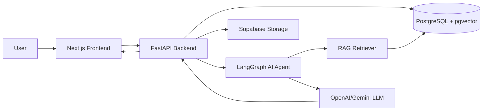

# Architecture

> Root architecture entrypoint for submission review.

AI Teaching Assistant uses a full-stack web architecture with RAG and LangGraph-based AI agents.

For the complete architecture document, see:

- [System Architecture](./docs/system_architecture.md)
- [AI Model & Agent Design](./docs/ai_model.md)
- [Data Pipeline](./docs/data_pipeline.md)

## Summary

## Main Components

| Component | Responsibility |
|---|---|
| Frontend | Student/lecturer UI, chat, dashboard, material viewer |
| Backend API | Auth, courses, materials, chat, analytics, moderation |
| Database | Users, courses, documents, chunks, chat history, feedback |
| Storage | Uploaded learning materials and converted PDFs |
| AI Agent | Route questions, retrieve course context, generate cited answers |
| External LLMs | Generate final grounded teaching response |

## Key Flows

- Lecturer uploads material → backend stores file → extracts text → chunks → embeds → saves to pgvector.
- Student asks question → router selects retrieval → retriever loads course chunks → tutor answers with citation.
- Feedback/report → saved with chat message → available for lecturer moderation.
