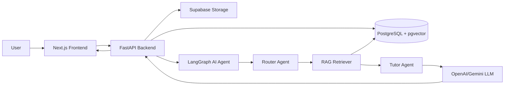
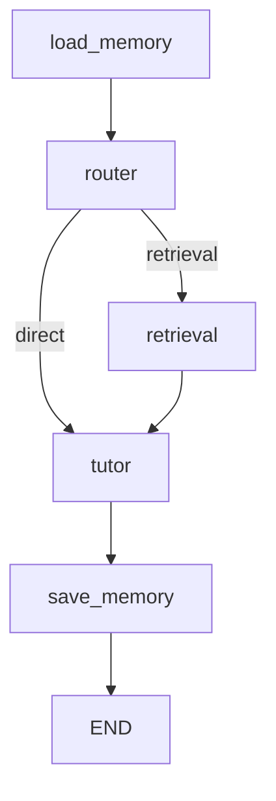

# AI Teaching Assistant

Nền tảng trợ giảng AI cho lớp học đại học, giúp sinh viên hỏi đáp theo tài liệu môn học và giúp giảng viên giảm tải các câu hỏi lặp lại.

## Quick Links

- [Product Requirement Document](./docs/PRD.md)
- [System Architecture](./docs/system_architecture.md)
- [AI Model & Agent Design](./docs/ai_model.md)
- [Data Pipeline](./docs/data_pipeline.md)
- [Evaluation Evidence](./docs/test.md)
- [Weekly Journal](./JOURNAL.md)
- [Worklog](./WORKLOG.md)
- [AI Agent Rules & Logging](./AGENTS.md)

## Problem

Trong các lớp học đại học có số lượng sinh viên lớn, giảng viên thường mất nhiều thời gian để trả lời các câu hỏi lặp lại. Sinh viên cũng khó tìm đúng nội dung cần ôn tập khi tài liệu nằm rải rác ở slide, PDF, transcript hoặc tài liệu tham khảo.

AI Teaching Assistant giải quyết vấn đề này bằng cách cho phép giảng viên upload tài liệu môn học, hệ thống index nội dung bằng RAG, sau đó sinh viên có thể hỏi đáp trực tiếp và nhận câu trả lời có trích dẫn nguồn.

## Main Features

### Student

- Đăng ký, đăng nhập và tham gia lớp bằng mã khóa học.
- Xem dashboard học tập cá nhân.
- Chat hỏi đáp theo từng khóa học.
- Nhận câu trả lời có trích dẫn nguồn từ tài liệu.
- Mở tài liệu gốc qua material viewer.
- Xem roadmap học tập và phần ôn tập.
- Làm quiz để kiểm tra kiến thức.
- Gửi feedback hoặc report câu trả lời chưa đúng.

### Lecturer

- Quản lý khóa học và mã tham gia lớp.
- Upload tài liệu học tập như PDF, slide, docx, txt và media transcript.
- Theo dõi trạng thái index tài liệu.
- Xem analytics về câu hỏi, hoạt động học tập và knowledge gaps.
- Quản lý moderation/feedback từ sinh viên.
- Xử lý yêu cầu bổ sung tài liệu.

### AI/RAG

- Tách tài liệu thành chunks theo ngữ nghĩa.
- Tạo embedding và lưu vào PostgreSQL + pgvector.
- Truy xuất tài liệu theo course.
- Kết hợp dense retrieval, BM25 sparse retrieval và hybrid retrieval.
- Dùng LangGraph để điều phối luồng agent.
- Router agent quyết định direct answer hoặc retrieval.
- Tutor agent trả lời dựa trên context và bắt buộc có citation.
- Lưu lịch sử hội thoại và memory.

## Tech Stack

| Layer | Technology |
|---|---|
| Frontend | Next.js 14, React 18, TypeScript, Tailwind CSS |
| Auth/UI | next-auth, Supabase client, shadcn-style components |
| Backend | FastAPI, Uvicorn/Gunicorn, Pydantic |
| Database | PostgreSQL, SQLAlchemy, pgvector |
| Storage | Supabase Storage |
| AI Orchestration | LangGraph, LangChain |
| LLM | OpenAI-compatible model, Gemini fallback |
| Retrieval | Dense search, BM25, hybrid retrieval, optional rerank |
| Document Processing | MarkItDown, PyPDFLoader, Mammoth, python-docx, Whisper path |
| Logging | AI prompt hooks via `.claude`, `.cursor`, `.codex`, `.gemini`, `.github` configs |

## Project Structure

```text
Teaching-Assistant/
├── frontend/                 # Next.js web app
│   ├── src/app/student/       # Student pages
│   ├── src/app/lecturer/      # Lecturer pages
│   └── src/components/        # Shared UI components
├── backend/                  # FastAPI backend
│   ├── src/app/              # API routes and FastAPI app
│   ├── src/agents/           # Router, tutor, retrieval, citation agents
│   ├── src/graph/            # LangGraph flow
│   ├── src/rag/              # Ingestion, embeddings, vector retrieval
│   └── src/memory/           # Conversation memory
├── docs/                     # Product, architecture and evaluation docs
├── reports/                  # Audit/report artifacts
├── scripts/                  # AI log hook setup scripts
├── README.md
├── JOURNAL.md
├── WORKLOG.md
└── AGENTS.md
```

## Architecture Overview



Agent flow:



## Setup

### 1. Clone project

```bash
git clone <repo-url>
cd Teaching-Assistant
```

### 2. Install AI logging hooks

Run once before creating a pull request:

```bash
bash scripts/setup_hooks.sh
```

Prompt logs are collected automatically by supported AI tools. Do not commit `.ai-log/*.jsonl` files.

### 3. Configure backend environment

Create backend environment file from your deployment/local credentials.

Typical variables:

```env
DATABASE_URL=<postgresql-url>
SUPABASE_URL=<supabase-url>
SUPABASE_KEY=<supabase-service-or-anon-key>
OPENAI_API_KEY=<openai-or-compatible-key>
GOOGLE_API_KEY=<gemini-key>
DEFAULT_MODEL=gpt-4o-mini
```

### 4. Configure frontend environment

Create `frontend/.env.local` with frontend-visible values:

```env
NEXT_PUBLIC_SUPABASE_URL=<supabase-url>
NEXT_PUBLIC_SUPABASE_ANON_KEY=<supabase-anon-key>
NEXT_PUBLIC_API_BASE_URL=http://localhost:8000
NEXTAUTH_SECRET=<secret>
NEXTAUTH_URL=http://localhost:3000
```

## Run Locally

### Backend

```bash
cd backend
python -m venv .venv
source .venv/bin/activate
pip install -r requirements.txt
uvicorn src.app.main:app --reload
```

Backend default URL:

```text
http://localhost:8000
```

Health check:

```text
GET http://localhost:8000/
```

### Frontend

```bash
cd frontend
npm install
npm run dev
```

Frontend default URL:

```text
http://localhost:3000
```

## Demo Accounts

When the backend starts with an empty database, it creates default accounts:

| Role | Email | Password |
|---|---|---|
| Lecturer | `lecturer@university.edu` | `lecturer123` |
| Student | `student@university.edu` | `student123` |

## Usage Guide

### Lecturer Flow

1. Log in as lecturer.
2. Create a course.
3. Share the enrollment code with students.
4. Upload course materials.
5. Wait for documents to be processed and indexed.
6. Review student questions, analytics, feedback and moderation reports.

### Student Flow

1. Log in as student.
2. Join a course with the enrollment code.
3. Open the course chat.
4. Ask questions about uploaded course materials.
5. Check citations and open source documents when needed.
6. Use roadmap/revision/quiz features for study guidance.

## API Highlights

| Endpoint | Purpose |
|---|---|
| `POST /api/auth/register` | Register user |
| `POST /api/auth/change-password` | Change password |
| `GET /api/courses` | List courses |
| `POST /api/courses` | Create course |
| `POST /api/courses/enroll` | Enroll student by code |
| `POST /api/materials/upload` | Upload and index material |
| `GET /api/chat/stream` | Stream AI chat response |
| `POST /api/chat/messages/{message_id}/feedback` | Submit answer feedback |
| `GET /api/chat/sessions` | List chat sessions |
| `GET /api/materials/requests` | List material requests |

## Evaluation

Evaluation evidence should cover:

- Authentication and role-based flows.
- Course creation and enrollment.
- Material upload and indexing.
- RAG answer correctness.
- Citation accuracy.
- Chat streaming stability.
- Feedback/report workflow.
- Lecturer analytics and moderation.

See [Evaluation Evidence](./docs/test.md).

## Documentation

- Product requirements: [docs/PRD.md](./docs/PRD.md)
- Architecture: [docs/system_architecture.md](./docs/system_architecture.md)
- AI model notes: [docs/ai_model.md](./docs/ai_model.md)
- Data pipeline: [docs/data_pipeline.md](./docs/data_pipeline.md)
- Weekly progress: [JOURNAL.md](./JOURNAL.md)
- Technical decisions: [WORKLOG.md](./WORKLOG.md)

## Pull Request Requirements

PR description must include:

```markdown
## Summary
<description of changes>

## Changes
- <list of changed files>
```

Before creating a PR, ensure:

```bash
bash scripts/setup_hooks.sh
```

## License

Course project / educational use.
