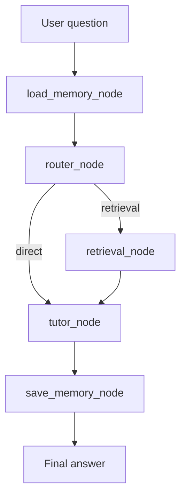
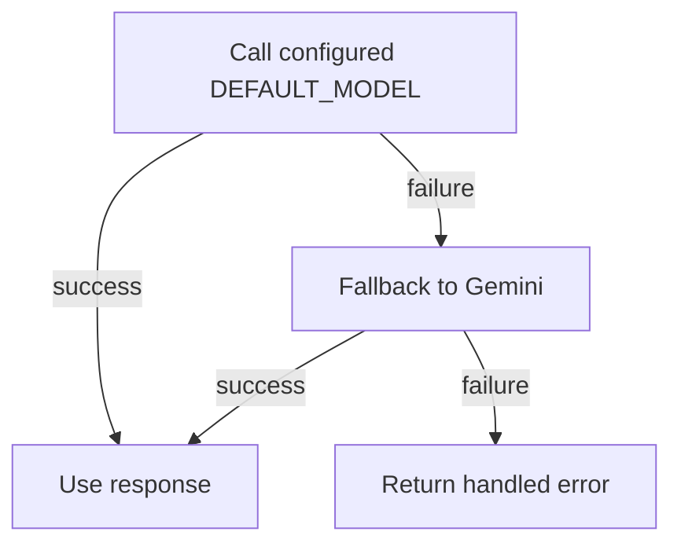

# AI Model & Agent Design

## Overview

AI Teaching Assistant dùng kiến trúc RAG kết hợp multi-agent orchestration để trả lời câu hỏi của sinh viên dựa trên tài liệu môn học.

Mục tiêu AI:

- Trả lời dựa trên tài liệu đã upload.
- Hạn chế hallucination bằng retrieval-first routing.
- Gắn citation/link nguồn vào câu trả lời.
- Hỗ trợ memory để cá nhân hóa hội thoại.
- Có fallback LLM khi model chính lỗi.

## AI Stack

| Layer | Implementation | Purpose |
|---|---|---|
| Agent orchestration | LangGraph | Điều phối flow load memory → route → retrieval → tutor → save memory |
| LLM interface | LangChain | Chuẩn hóa gọi OpenAI-compatible model và Gemini |
| Primary model | `DEFAULT_MODEL` từ config | Model chính cho router/tutor |
| Fallback model | Gemini | Dự phòng khi model chính lỗi |
| Embedding | `src.rag.embedding.get_embedding()` | Chuyển query/chunk thành vector |
| Vector search | PostgreSQL + pgvector | Tìm chunks theo cosine distance |
| Sparse search | BM25 | Tìm kiếm keyword-based |
| Retrieval fusion | Hybrid + RRF | Kết hợp dense và sparse results |
| Optional rerank | CrossEncoder local | Rerank nếu môi trường đủ RAM |
| Memory | `src.memory.*` | Lưu và load thông tin hội thoại |

## LangGraph Flow



Source files:

| File | Role |
|---|---|
| `backend/src/base_agent.py` | Public API: `run_agent()` and `astream_agent()` |
| `backend/src/graph/builder.py` | Builds LangGraph state graph |
| `backend/src/graph/state.py` | Shared agent state schema |
| `backend/src/graph/nodes/load_memory_node.py` | Loads user memory |
| `backend/src/graph/nodes/router_node.py` | Calls router agent |
| `backend/src/graph/nodes/retrieval_node.py` | Calls retriever |
| `backend/src/graph/nodes/tutor_node.py` | Calls tutor agent |
| `backend/src/graph/nodes/save_memory_node.py` | Saves conversation memory |

## Agent State

The graph passes a shared state with fields such as:

| Field | Meaning |
|---|---|
| `messages` | User and assistant messages |
| `user_id` | Current user |
| `session_id` | Chat session |
| `course_id` | Course context for retrieval |
| `user_profile` | User metadata/profile |
| `route` | Router decision: `retrieval` or `direct` |
| `route_reason` | Short explanation from router |
| `context` | Retrieved document chunks |
| `sources` | Citation metadata |
| `memory_block` | Loaded user memory |
| `final_answer` | Final assistant response |

## Router Agent

Source: `backend/src/agents/router_agent.py`

Router decides whether a question should use retrieval.

Rules:

- `direct`: only for explicit greetings or thanks.
- `retrieval`: default for academic questions, facts, course content, definitions, or any real question.
- If LLM route parsing fails, heuristic fallback defaults to retrieval for academic safety.

Router prompt requires strict JSON:

```json
{"route":"retrieval|direct","reason":"short reason"}
```

Why retrieval-first:

- Forces system to check course database before answering.
- Reduces hallucination.
- Keeps responses grounded in uploaded materials.

## Retrieval Design

Source: `backend/src/rag/retriever.py`

Retrieval modes:

| Mode | Function | Description |
|---|---|---|
| Dense | `retrieve_dense()` | Embeds query and searches `document_chunks.embedding` with pgvector cosine distance |
| Sparse | `retrieve_sparse()` | BM25 keyword retrieval over indexed text |
| Hybrid | `retrieve_hybrid()` | Combines dense and sparse results using Reciprocal Rank Fusion |
| Rerank | `rerank()` | Optional CrossEncoder rerank on local/non-cloud environment |

Course and visibility filtering:

- Retrieval joins document chunks with documents and course links.
- Results are filtered by `course_id`.
- Hidden materials are excluded with `Document.is_visible == True`.
- Only indexed documents are used with `Document.status == "indexed"`.

## Tutor Agent

Source: `backend/src/agents/tutor_agent.py`

Tutor agent generates the final answer.

Behavior:

- Uses low temperature for academic grounding.
- Receives formatted context blocks from retrieved chunks.
- Requires citation links for source-backed claims.
- Keeps teaching tone clear and supportive.
- If answer is not supported by context, suggests requesting more material.
- Can call `create_material_request_tool` when user confirms a material request.

Citation format is generated from chunk metadata:

| Source type | Citation behavior |
|---|---|
| PDF/document page | Link includes document id and `#page=<page>` |
| Audio/video transcript | Link includes document id and timestamp `t=<seconds>` |
| Text/Markdown/DOCX | Link opens material viewer for the source document |

Example citation link:

```markdown
[Nguồn: Lecture_3.pdf (Trang 5)](/student/materials/viewer/<document_id>?visible=True#page=5)
```

## Streaming Response

Source: `backend/src/base_agent.py` and `backend/src/app/routes.py`

Streaming endpoint:

```text
GET /api/chat/stream
```

Stream output types:

| Type | Purpose |
|---|---|
| `metadata` | Sends sources/chunks early to frontend |
| `token` | Streams final answer word-by-word |
| `debug` | Sends full final content and metadata for inspection |
| `message_id` | Lets frontend attach feedback to saved assistant message |
| `[DONE]` | Ends SSE stream |

## Prompt Design

Tutor prompt principles:

- Use only retrieved course knowledge when context exists.
- Every sourced claim must include citation.
- Do not invent missing facts.
- Explain in student-friendly Vietnamese.
- If context is insufficient, ask for more material instead of hallucinating.

Core instruction pattern:

```text
BẠN ĐANG TRONG CHẾ ĐỘ 'HỖ TRỢ HỌC TẬP CHÍNH XÁC'.
CHỈ ĐƯỢC SỬ DỤNG DỮ LIỆU DƯỚI ĐÂY ĐỂ TRẢ LỜI.
Mọi thông tin lấy từ tài liệu PHẢI có link trích dẫn tương ứng.
Nếu thông tin không có trong dữ liệu, hãy xin lỗi và đề xuất gửi yêu cầu tài liệu.
```

## Memory

Memory is used to improve continuity across chat sessions.

| Stage | Responsibility |
|---|---|
| Load memory | Retrieve relevant previous user context before routing/tutoring |
| Use memory | Provide personalization if relevant |
| Save memory | Persist useful facts after answer generation |

Memory must not override course material evidence. Retrieved source context has priority for factual answers.

## Model Fallback Strategy



Fallback is used in:

- Router LLM
- Tutor LLM

Benefits:

- Higher availability during provider errors.
- Reduced chance of total chat failure.
- Better demo reliability.

## Safety and Quality Controls

| Risk | Mitigation |
|---|---|
| Hallucination | Retrieval-first routing and context-only tutor prompt |
| Wrong course source | Retrieval filters by `course_id` |
| Hidden material leakage | Retrieval filters by `is_visible` |
| Missing citation | Tutor prompt requires citation after source-backed claims |
| LLM outage | Gemini fallback |
| Cloud memory limits | Rerank disabled in constrained environments |

## Evaluation Metrics

Recommended evaluation metrics:

| Metric | How to measure |
|---|---|
| Retrieval hit rate | Whether top-k chunks contain answer evidence |
| Answer correctness | Human label: correct / partially correct / incorrect |
| Citation accuracy | Whether citation points to relevant source/page/timestamp |
| Response latency | Time from user question to final token |
| Unsupported-question behavior | Whether assistant refuses or requests material when source missing |
| User satisfaction | Student/lecturer feedback rating |

## Known Limitations

- Answer quality depends on uploaded document quality.
- Scanned PDFs may need OCR support if text extraction fails.
- BM25 sparse index is in-memory and may need rebuild strategy in production.
- Reranking may be disabled on low-memory hosting.
- Current broad CORS config should be restricted in production.