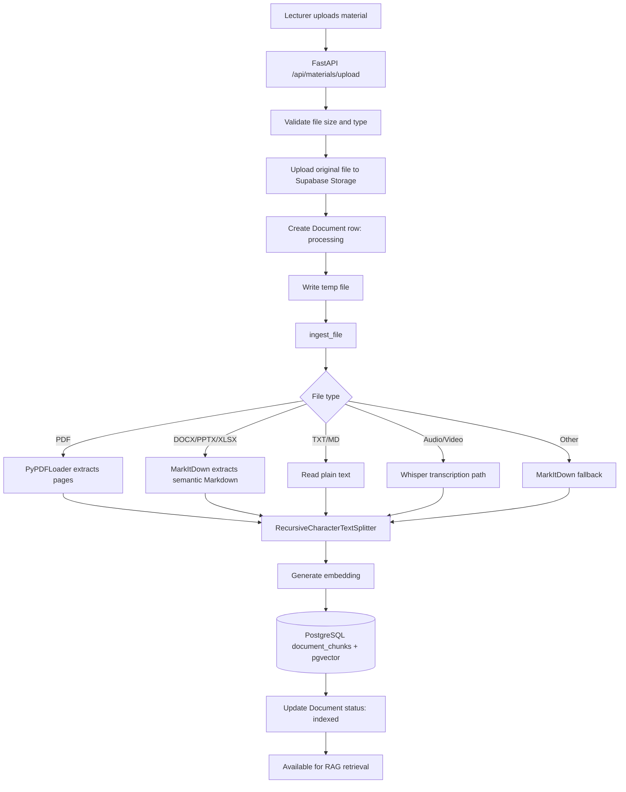
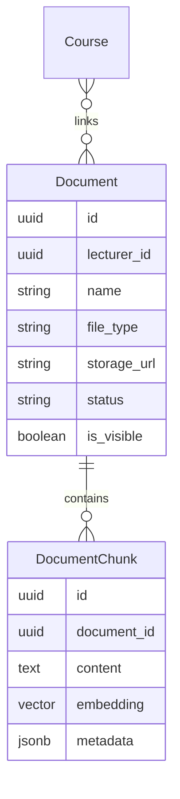
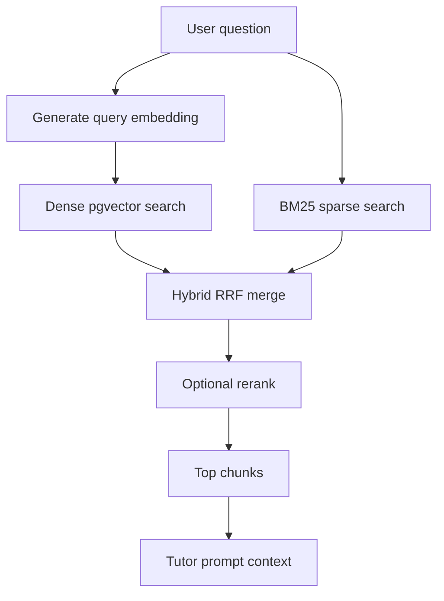

# Data Pipeline

## Overview

Data pipeline xử lý tài liệu môn học để phục vụ RAG chat. Giảng viên upload tài liệu, backend lưu file vào Supabase Storage, trích xuất text, chia chunk, tạo embedding và lưu vào PostgreSQL + pgvector để truy xuất theo khóa học.

## End-to-End Flow



## Source Files

| File | Responsibility |
|---|---|
| `backend/src/app/routes.py` | Upload endpoint, storage sync, document status updates |
| `backend/src/rag/ingest.py` | Text extraction, chunking and embedding persistence |
| `backend/src/rag/embedding.py` | Embedding model factory |
| `backend/src/rag/retriever.py` | Dense, sparse and hybrid retrieval |
| `backend/src/models.py` | Document and DocumentChunk database schema |
| `backend/src/database.py` | SQLAlchemy database session |
| `backend/src/supabase_client.py` | Supabase client configuration |

## Step 1 — Upload

Endpoint:

```text
POST /api/materials/upload
```

Inputs:

| Field | Meaning |
|---|---|
| `file` | Uploaded material |
| `course_id` | Optional course to link document |
| `lecturer_id` | Owner/uploader |

Validation:

- Document files: max 10 MB.
- Media files: max 25 MB.
- Duplicate file names for the same lecturer are reused and linked to the new course.

Storage behavior:

- File is uploaded to Supabase bucket `course-materials`.
- Storage path format:

```text
library/<lecturer_id-or-shared>/<safe_filename>
```

- A `documents` row is created with status `processing`.

## Step 2 — Text Extraction

Extraction is handled by `ingest_file()`.

| File type | Extraction method | Metadata captured |
|---|---|---|
| `pdf` | `PyPDFLoader` | source, file path, format, document id, page number |
| `docx`, `pptx`, `xlsx` | `MarkItDown` | source, file path, format, document id |
| `txt`, `md` | UTF-8 direct read | source, file path, format, document id |
| `mp3`, `mp4`, `wav`, `m4a`, `flac` | Whisper transcription path | source, file path, format, document id, timestamps in text |
| Other | MarkItDown fallback | source, file path, format, document id |

Media transcription stores timestamp markers like:

```text
[t=123s] transcript text
```

These markers are later used to create citation links to a specific time in the material viewer.

## Step 3 — Chunking

Chunking uses `RecursiveCharacterTextSplitter`.

Config comes from `src.config`:

| Config | Meaning |
|---|---|
| `CHUNK_SIZE` | Max chunk size |
| `CHUNK_OVERLAP` | Overlap between adjacent chunks |

Semantic separators:

```text
\n# , \n## , \n### , \n#### , blank lines, line breaks, sentences, spaces
```

Why chunking matters:

- Keeps context small enough for LLM input.
- Improves retrieval precision.
- Preserves headings/sections when possible.
- Enables page/time/source citation metadata.

## Step 4 — Embedding

Each chunk is converted to an embedding.

Code path:

```text
get_embedding() -> embed_query(chunk.page_content)
```

Fallback shape:

- LangChain-style embedding model: `embed_query()`.
- SentenceTransformer-style model: `encode(...).tolist()`.

Database field:

```text
document_chunks.embedding Vector(768)
```

768 dimensions are optimized for the configured embedding model path in code.

## Step 5 — Persistence

Chunk records are saved in PostgreSQL.



DocumentChunk fields:

| Field | Source |
|---|---|
| `document_id` | Created document row |
| `content` | Chunk text |
| `embedding` | Generated vector |
| `metadata_json` | Source, format, page/time and document metadata |

## Step 6 — Course Linking

Documents can be linked to courses through `course_document_links`.

This supports:

- One document reused across multiple courses.
- Course-specific retrieval.
- Lecturer library behavior.

Retrieval only returns chunks linked to the active `course_id`.

## Step 7 — Retrieval

The chat pipeline calls retrieval when router selects `retrieval`.



Retrieval filters:

- `course_id` must match active course.
- `Document.is_visible == True`.
- `Document.status == "indexed"`.

Retrieval modes:

| Mode | Purpose |
|---|---|
| Dense | Semantic similarity search |
| Sparse | Keyword matching |
| Hybrid | Better recall by combining dense and sparse |
| Rerank | Better precision when local resources allow |

## Step 8 — Citation Creation

Tutor agent formats retrieved chunks into citation-ready context.

Citation rules:

| Metadata | Citation output |
|---|---|
| `page` exists | Link includes `#page=<page>` |
| transcript timestamp exists | Link includes `?t=<seconds>` |
| no page/time | Link opens source document viewer |

Example:

```markdown
[Nguồn: Lecture_3.pdf (Trang 5)](/student/materials/viewer/<document_id>?visible=True#page=5)
```

## Step 9 — Chat Storage

When a student asks a question:

1. Backend creates or loads `ChatSession`.
2. User message is saved as `ChatMessage(role="user")`.
3. Agent generates streamed answer.
4. Assistant message is saved as `ChatMessage(role="assistant")`.
5. Sources are stored in `ChatMessage.sources`.
6. Frontend receives `message_id` for feedback/report.

## Data Quality Controls

| Risk | Mitigation |
|---|---|
| Duplicate uploads | Detect existing document by name + lecturer |
| Oversized files | Reject by size limit |
| Hidden documents appearing in chat | Filter by `is_visible` |
| Wrong course context | Filter by course-document link |
| Missing source | Store metadata on each chunk |
| LLM hallucination | Tutor prompt requires context and citations |

## Current Limitations

- Scanned PDFs may require OCR before text extraction.
- BM25 index is in-memory and may need persistent rebuild strategy.
- Large media transcription depends on external Whisper/API availability.
- Office-to-PDF conversion depends on LibreOffice availability if standardized PDF output is needed.
- Upload temp files should be cleaned in long-running production environments.

## Submission Evidence

This pipeline supports these evaluation artifacts:

- Screenshot of lecturer upload page.
- Screenshot of indexed material list.
- Example uploaded document.
- Example student question.
- AI answer with citation link.
- Material viewer opened at cited page/time.
- Backend/API test result for upload and chat.
