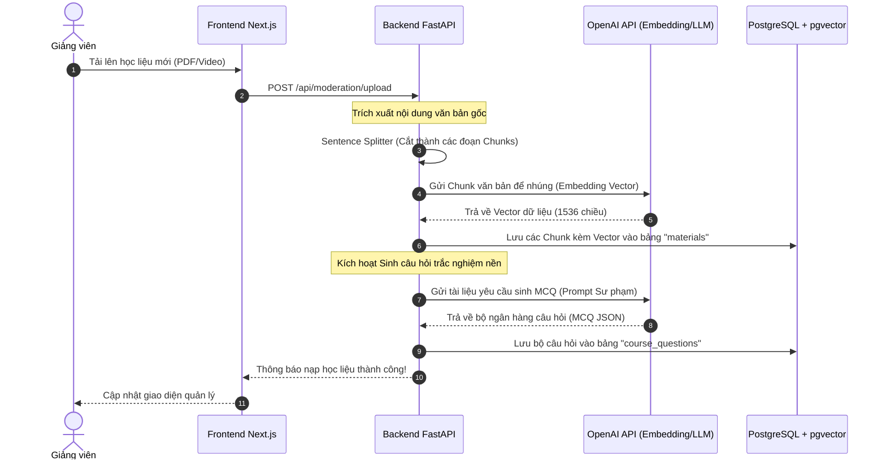
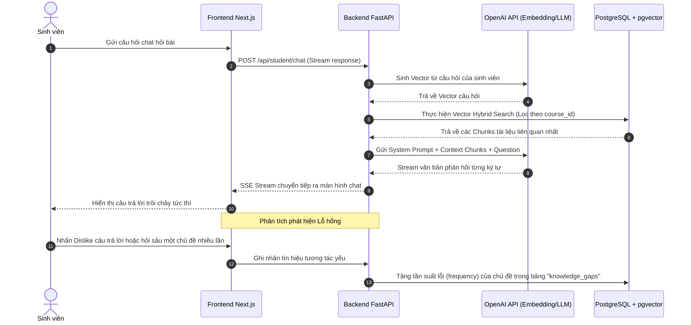
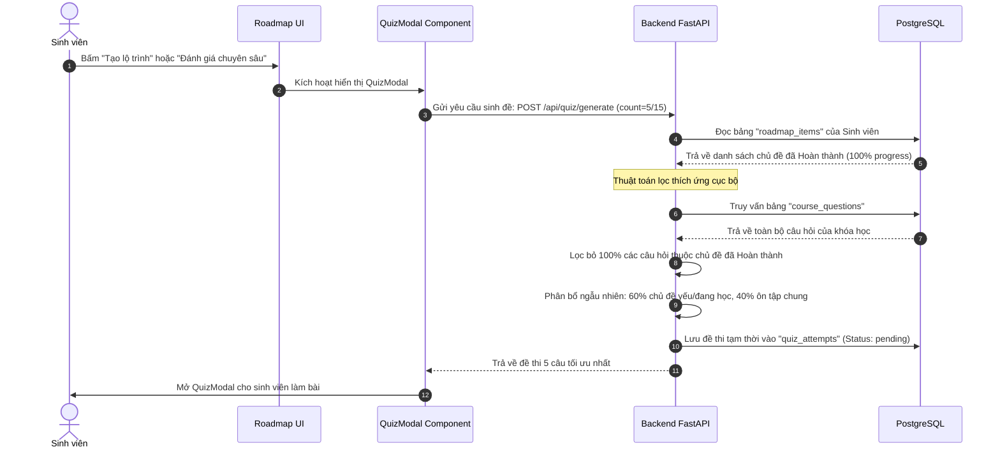
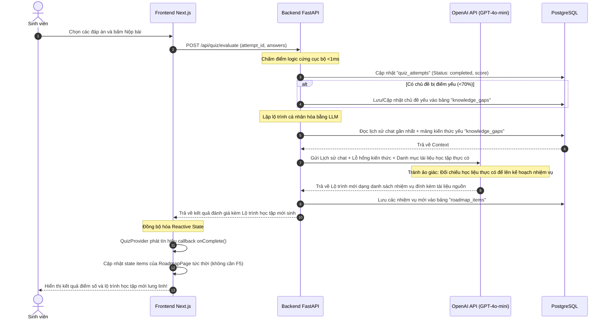

# TÀI LIỆU KIẾN TRÚC HỆ THỐNG VÀ QUY TRÌNH HOẠT ĐỘNG
*(System Architecture & Core Workflows Documentation)*

Tài liệu này mô tả chi tiết kiến trúc tổng quan hệ thống, luồng dữ liệu đa tầng và giải thích cặn kẽ 4 quy trình hoạt động (workflows) cốt lõi của ứng dụng Trợ lý Học tập AI (AI Teaching Assistant).

---

## 🏛️ I. KIẾN TRÚC TỔNG QUAN (SYSTEM ARCHITECTURE OVERVIEW)

Hệ thống được xây dựng trên mô hình 3 lớp hiện đại (3-Tier Architecture) kết hợp RAG (Retrieval-Augmented Generation) và thuật toán tự thích ứng cục bộ:

```
+-----------------------------------------------------------+
|                   FRONTEND LAYER (Next.js 14)             |
|  - Student Portal (Roadmap UI, Chat RAG, Quiz Modal)      |
|  - Lecturer Portal (Materials Mgmt, MCQ Editor, Chunks)   |
|  - Global State Orchestration (QuizProvider Context)      |
+-----------------------------+-----------------------------+
                              | HTTPS (JSON / SSE Stream)
                              v
+-----------------------------------------------------------+
|                   BACKEND LAYER (FastAPI)                 |
|  - CORS & Middleware Gateway                              |
|  - RESTful APIs (Auth, Courses, Moderation, Analytics)    |
|  - RAG Core Search Engine & Local Adaptive Quiz Sampler   |
+-----------------------------+-----------------------------+
                              | SQL / pgvector / API Calls
                              v
+-----------------------------------------------------------+
|                   DATA & AI SERVICES LAYER                |
|  - PostgreSQL Database (Structured Relational Data)       |
|  - pgvector Extension (Vector Embeddings Store)           |
|  - OpenAI GPT-4o-mini (LLM Text Generation & MCQs)       |
+-----------------------------------------------------------+
```

---

## 🔄 II. CÁC QUY TRÌNH HOẠT ĐỘNG CỐT LÕI (CORE WORKFLOWS)

### 1. Quy trình Nạp Học liệu & Sinh câu hỏi MCQ (Material Ingestion Workflow)

Quy trình tự động hóa việc tải lên tài liệu học tập mới (PDF hoặc Video) và sinh sẵn ngân hàng câu hỏi trắc nghiệm nền:



#### 🔍 Giải thích chi tiết luồng hoạt động:
1.  **Tải file:** Giảng viên thực hiện upload tài liệu (dạng PDF học tập hoặc video bài giảng) thông qua giao diện quản lý học liệu của Giảng viên.
2.  **Xử lý nội dung gốc:** Backend FastAPI tiếp nhận file, trích xuất text thuần túy (và dùng Whisper API / SRT parser đối với Video). Sau đó sử dụng bộ tách câu thông minh `Sentence Splitter` cắt văn bản thành các đoạn Chunks tối ưu (1000 ký tự, overlap 200 ký tự) để đảm bảo ngữ cảnh liền mạch.
3.  **Tạo Vector lưu trữ:** Từng Chunk văn bản được gửi lên OpenAI Embedding API để tạo vector biểu diễn ngữ nghĩa 1536 chiều, sau đó lưu toàn bộ Chunks kèm Vector tương ứng vào bảng `materials` được cấu hình mở rộng `pgvector` trong PostgreSQL.
4.  **Sinh câu hỏi MCQ nền:** Để tối ưu độ trễ khi sinh viên làm bài, hệ thống chạy một background task gọi mô hình OpenAI GPT-4o-mini kèm Prompt sư phạm chuẩn để soạn sẵn **10 câu hỏi trắc nghiệm** tương ứng với tài liệu vừa upload.
5.  **Lưu kho MCQ:** Bộ câu hỏi (gồm câu hỏi, 4 đáp án nhiễu, đáp án đúng và lời giải thích học thuật) được lưu trữ trực tiếp vào bảng `course_questions`.

---

### 2. Quy trình Trò chuyện RAG & Lưu vết Lỗ hổng (RAG Chat & Knowledge Gap Workflow)

Quy trình sinh viên trò chuyện hỏi đáp trực tiếp dựa trên tài liệu lớp học và tự động tích lũy các lỗ hổng kiến thức:



#### 🔍 Giải thích chi tiết luồng hoạt động:
1.  **Gửi câu hỏi:** Sinh viên nhập câu hỏi vào khung chat. Next.js gửi yêu cầu `POST /api/student/chat` hỗ trợ truyền luồng dữ liệu thời gian thực (Server-Sent Events - SSE).
2.  **Truy vấn RAG:** Backend FastAPI chuyển câu hỏi của sinh viên thành Vector embedding và thực hiện tìm kiếm tương đồng (Cosine Similarity) trên bảng `materials`. Phép tìm kiếm được lọc theo khóa `course_id` (Hybrid Search) bằng SQL chuẩn để đảm bảo chỉ trả về tài liệu thuộc khóa học đó trong chưa đầy 15ms.
3.  **Sinh câu trả lời thông minh:** Backend lắp ghép các Chunks tài liệu tìm thấy vào System Prompt tạo thành bối cảnh sạch (Context). Sau đó gửi tới OpenAI GPT-4o-mini để yêu cầu trả lời, bắt buộc phải trích dẫn nguồn học liệu gốc và từ chối các câu hỏi ngoài lề.
4.  **Streaming UI:** Câu trả lời được stream trực tiếp về giao diện giúp sinh viên có phản hồi tức thì mà không cần chờ đợi.
5.  **Lưu vết lỗ hổng:** Hệ thống ngầm lắng nghe các tín hiệu tương tác của sinh viên (Ví dụ: sinh viên nhấn dislike câu trả lời, hoặc liên tục hỏi sâu về một chủ đề trong 1 phiên chat). Tín hiệu này được ghi nhận và cộng dồn chỉ số tần suất lỗi vào bảng `knowledge_gaps` phục vụ việc đề xuất ôn luyện.

---

### 3. Quy trình Đánh giá Năng lực thích ứng (Adaptive Assessment Workflow)

Quy trình lắp ghép đề thi thích ứng 5 câu (hoặc 15 câu) cục bộ siêu tốc từ DB Vector:



#### 🔍 Giải thích chi tiết luồng hoạt động:
1.  **Khởi động Quiz:** Sinh viên bấm "Tạo lộ trình học tập" lần đầu hoặc bấm "Làm bài kiểm tra ôn tập 15 câu".
2.  **Quét Spaced Repetition:** Backend truy vấn bảng `roadmap_items` của sinh viên đó, lọc ra toàn bộ các chủ đề đã đạt tiến độ **100%** (Học giỏi) để loại bỏ hoàn toàn các câu hỏi liên quan ra khỏi đề thi, giúp sinh viên tập trung vào các mảng kiến thức mới.
3.  **Lắp đề theo trọng số 60-40:** Backend bốc từ kho `course_questions` của môn học: **60%** số câu hỏi tập trung vào các chủ đề sinh viên đang yếu (ưu tiên `high` hoặc đang học dở) và **40%** số câu hỏi còn lại phục vụ ôn tập tổng hợp.
4.  **Tốc độ đột phá:** Toàn bộ thuật toán bốc đề thích ứng được thực hiện cục bộ thông qua mã nguồn Python tối ưu và truy vấn cơ sở dữ liệu nên đạt độ trễ cực thấp **(<10ms)**, triệt tiêu hoàn toàn thời gian chờ đợi tải đề.

---

### 4. Quy trình Lập Lộ trình học tập Cá nhân hóa (Personalized Roadmap Generation Workflow)

Quy trình tự động chấm điểm cục bộ và kích hoạt AI sinh lộ trình học tập cá nhân hóa tức thời:



#### 🔍 Giải thích chi tiết luồng hoạt động:
1.  **Nộp bài:** Sinh viên nhấn nút "Nộp bài", gửi các đáp án đã chọn lên Backend.
2.  **Chấm điểm & Lưu vết:** Backend so khớp đáp án cực nhanh bằng logic Python, lưu điểm số vào `quiz_attempts`. Nếu điểm số của bất kỳ chủ đề nào dưới **70%**, chủ đề đó lập tức được đẩy vào danh sách lỗ hổng `knowledge_gaps`.
3.  **Sinh lộ trình không ảo giác:** Backend tập hợp lịch sử chat gần nhất + lỗ hổng từ bài làm và danh mục tài liệu giảng dạy thực tế của lớp học (`available_sources`) gửi tới OpenAI GPT-4o-mini. LLM thực hiện so khớp và lên danh sách các nhiệm vụ cụ thể đính kèm nguồn học liệu gốc (ví dụ: `Đọc Slide 3 trong [Activation_Functions.pdf]`) để đảm bảo sinh viên có tài liệu ôn tập thực tế.
4.  **Đồng bộ hóa Reactive State Frontend:** Kết quả trả về Modal `QuizModal`. Nhờ Context wrapper `QuizProvider.tsx`, `QuizModal` kích hoạt callback `onComplete()`, truyền trực tiếp danh sách lộ trình mới sinh về hàm cập nhật state của `RoadmapPage`. Giao diện cập nhật vòng tròn tiến độ và danh sách nhiệm vụ học tập ngay lập tức mà không cần F5 trình duyệt.