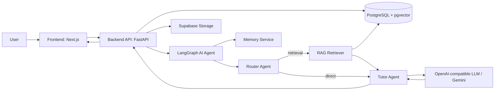
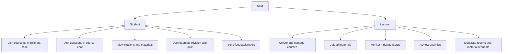
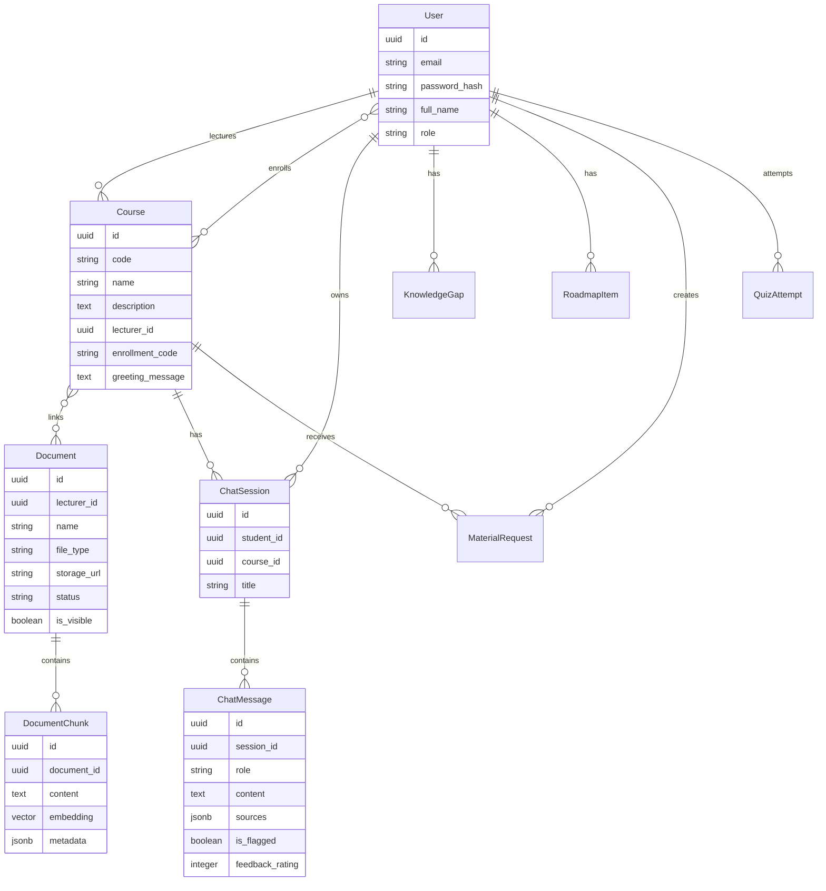
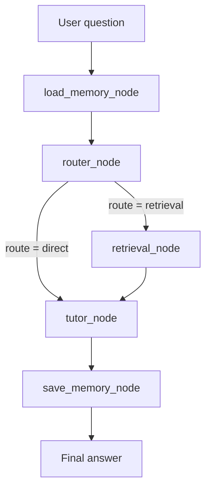
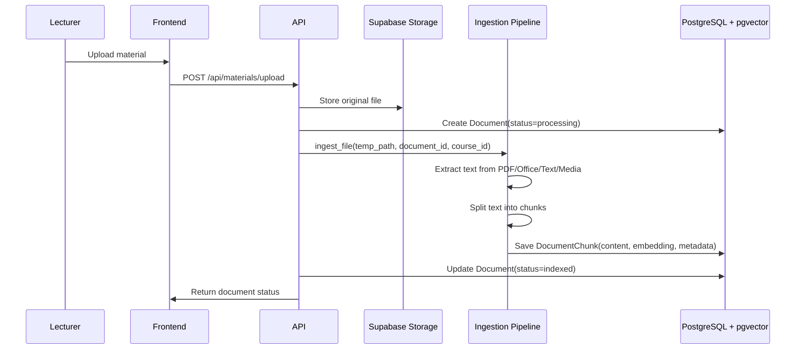
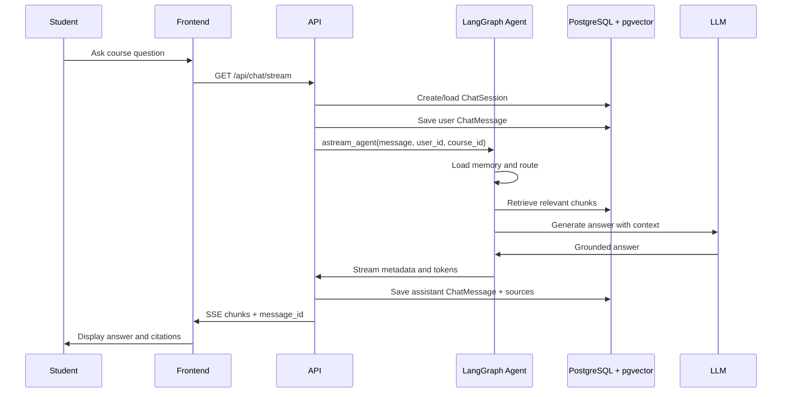
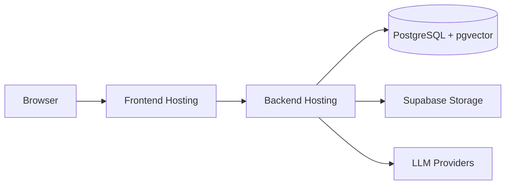

# System Architecture

## Overview

AI Teaching Assistant là hệ thống web full-stack dùng kiến trúc RAG (Retrieval-Augmented Generation) và multi-agent orchestration để trả lời câu hỏi của sinh viên dựa trên tài liệu môn học.

Mục tiêu kiến trúc:

- Sinh viên hỏi đáp nhanh theo tài liệu khóa học.
- Giảng viên upload, quản lý tài liệu và theo dõi nhu cầu học tập.
- Câu trả lời của AI có trích dẫn nguồn rõ ràng.
- Dữ liệu lớp học, tài liệu, chat và feedback được lưu lại để phân tích.

## High-Level Architecture



## Main Components

| Component | Technology | Responsibility |
|---|---|---|
| Frontend | Next.js 14, React 18, TypeScript, Tailwind CSS | Student/lecturer UI, chat, dashboard, material viewer |
| Backend API | FastAPI, Pydantic, SQLAlchemy | Auth, courses, materials, chat, analytics, moderation |
| Database | PostgreSQL + pgvector | Users, courses, documents, chunks, chat history, feedback, roadmap, quiz |
| Storage | Supabase Storage | Uploaded course files and converted PDFs |
| AI Agent | LangGraph + LangChain | Route questions, retrieve context, generate grounded answers |
| Retrieval | Dense vector search, BM25, hybrid retrieval | Find relevant course document chunks |
| LLM | OpenAI-compatible model, Gemini fallback | Generate answer from retrieved context |
| Logging | AI hook configs + `.ai-log` | Prompt/tool call logging for submission workflow |

## User Roles



## Frontend Architecture

Frontend được tổ chức theo App Router của Next.js.

```text
frontend/src/
├── app/
│   ├── page.tsx
│   ├── login/page.tsx
│   ├── signup/page.tsx
│   ├── student/
│   │   ├── dashboard/page.tsx
│   │   ├── chat/page.tsx
│   │   ├── courses/[id]/page.tsx
│   │   ├── materials/page.tsx
│   │   ├── materials/viewer/[id]/page.tsx
│   │   ├── roadmap/page.tsx
│   │   └── revision/page.tsx
│   └── lecturer/
│       ├── dashboard/page.tsx
│       ├── analytics/page.tsx
│       ├── materials/page.tsx
│       ├── moderation/page.tsx
│       └── courses/[id]/page.tsx
├── components/
│   ├── student/StudentChat.tsx
│   ├── materials/MaterialViewer.tsx
│   ├── StudentHeader.tsx
│   ├── LecturerHeader.tsx
│   └── ui/
└── lib/ and utils/
```

Frontend responsibilities:

- Render separate student and lecturer experiences.
- Call FastAPI endpoints for courses, materials and chat.
- Stream AI responses via Server-Sent Events.
- Display citations and source documents.
- Collect feedback/report actions.

## Backend Architecture

Backend là FastAPI application.

```text
backend/src/
├── app/
│   ├── main.py                 # FastAPI entrypoint
│   ├── routes.py               # Core API routes
│   ├── analytics_routes.py     # Lecturer analytics API
│   └── moderation_routes.py    # Moderation API
├── agents/
│   ├── router_agent.py
│   ├── tutor_agent.py
│   ├── retrieval_agent.py
│   ├── citation_agent.py
│   └── reasoning_agent.py
├── graph/
│   ├── builder.py              # LangGraph flow
│   └── nodes/
├── rag/
│   ├── ingest.py               # File processing and chunking
│   ├── embedding.py
│   ├── retriever.py
│   └── vectorstore.py
├── memory/
├── roadmap/
├── quiz/
├── analytics/
├── models.py
└── database.py
```

Backend responsibilities:

- Initialize FastAPI app and CORS.
- Create database tables on startup.
- Create default demo accounts when database is empty.
- Manage users, courses, enrollment and materials.
- Upload files to Supabase Storage.
- Extract, chunk and embed documents.
- Stream AI chat responses.
- Save chat sessions, messages, sources and feedback.

## Database Schema Summary



Core tables:

| Table | Purpose |
|---|---|
| `users` | Student/lecturer accounts |
| `courses` | Course metadata and enrollment code |
| `course_enrollments` | Student-course many-to-many relation |
| `documents` | Uploaded material metadata |
| `course_document_links` | Course-document many-to-many relation |
| `document_chunks` | Chunk text + pgvector embedding |
| `chat_sessions` | Student chat sessions per course |
| `chat_messages` | User/assistant messages and citations |
| `knowledge_gaps` | Detected weak topics |
| `roadmap_items` | Personalized study roadmap |
| `material_requests` | Student requests for extra materials |
| `quiz_attempts` | Quiz questions, answers and scores |

## AI Agent Architecture

The agent is built with LangGraph.



Agent node responsibilities:

| Node | Responsibility |
|---|---|
| `load_memory_node` | Load relevant user memory/context |
| `router_node` | Decide whether to use retrieval or direct response |
| `retrieval_node` | Retrieve course-specific chunks |
| `tutor_node` | Generate grounded teaching answer with citations |
| `save_memory_node` | Persist useful conversation memory |

Router behavior:

- Greetings and thanks can use direct route.
- Academic questions default to retrieval for safety.
- Fallback logic uses retrieval to reduce hallucination.

Tutor behavior:

- Uses retrieved context when available.
- Requires citation links after source-backed claims.
- If source is missing, asks student to request more material.
- Supports material request tool when student confirms.

## RAG Data Flow



Supported ingestion paths:

| File type | Processing path |
|---|---|
| PDF | PyPDFLoader extracts pages and page metadata |
| DOCX/PPTX/XLSX | MarkItDown converts to semantic Markdown |
| TXT/MD | Direct text read |
| MP3/MP4/WAV/M4A/FLAC | Whisper transcription path |
| Other | MarkItDown fallback |

## Chat Data Flow



## API Map

| Endpoint | Method | Purpose |
|---|---:|---|
| `/` | GET | Health check |
| `/api/auth/register` | POST | Register user |
| `/api/auth/change-password` | POST | Change password |
| `/api/courses` | GET | List courses |
| `/api/courses` | POST | Create course |
| `/api/courses/{course_id}` | GET | Get course detail |
| `/api/courses/enroll` | POST | Enroll student by code |
| `/api/courses/{course_id}/students` | GET | List course students |
| `/api/materials/upload` | POST | Upload and index material |
| `/api/materials/{document_id}` | GET | Get material details |
| `/api/materials/{document_id}` | DELETE | Delete material |
| `/api/materials/{document_id}/visibility` | PATCH | Toggle material visibility |
| `/api/materials/request` | POST | Create material request |
| `/api/materials/requests` | GET | List material requests |
| `/api/chat` | POST | Non-stream chat response |
| `/api/chat/stream` | GET | SSE streaming chat |
| `/api/chat/sessions` | GET | List chat sessions |
| `/api/chat/sessions/{session_id}/messages` | GET | List session messages |
| `/api/chat/messages/{message_id}/feedback` | POST | Submit rating/report |

## External Services

| Service | Usage |
|---|---|
| Supabase Storage | Store uploaded files and standardized PDFs |
| PostgreSQL | Application database |
| pgvector | Similarity search over document chunks |
| OpenAI-compatible API | Primary LLM/embedding path depending on config |
| Gemini API | Fallback LLM path |
| Whisper API path | Audio/video transcription path |

## Security and Access Model

Current access model:

- Users have role: `student` or `lecturer`.
- Students join courses by enrollment code.
- Course-specific retrieval filters chunks by `course_id`.
- Materials can be hidden through `is_visible`.
- Passwords are hashed with bcrypt.
- Feedback/report data is persisted for moderation.

Operational notes:

- API currently enables broad CORS for development.
- Production deployment should restrict CORS origins.
- Secrets must stay in environment variables and must not be committed.
- `.ai-log/*.jsonl` files should not be committed.

## Reliability and Fallbacks

- Router has heuristic fallback if LLM routing fails.
- Tutor LLM uses configured model with Gemini fallback.
- Retrieval defaults to document search for academic safety.
- Reranking is disabled in constrained cloud environments to reduce memory use.
- File deletion attempts storage/vector cleanup and logs non-critical failures.

## Deployment View



Recommended deployment:

- Frontend: Vercel or compatible Next.js host.
- Backend: Render/Railway/Fly.io with Python runtime.
- Database: Supabase/PostgreSQL with pgvector enabled.
- Storage: Supabase bucket for course materials.
- Secrets: host environment variables.

## Evaluation Touchpoints

Architecture supports these submission checks:

| Requirement | Evidence location |
|---|---|
| Product goal alignment | `docs/PRD.md`, README |
| Stable system behavior | API routes, chat streaming, persistence |
| Accurate agent response | RAG retrieval + citations |
| Tested scenarios | `docs/test.md` |
| AI prompt/tool logging | `AGENTS.md`, hook configs, `.ai-log` workflow |
| Work tracking | `WORKLOG.md`, `JOURNAL.md` |