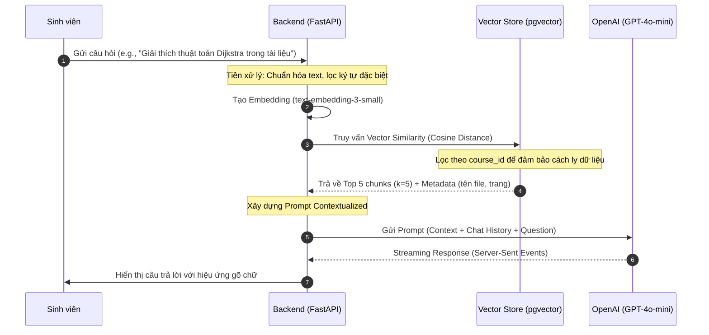

# Đặc tả Kỹ thuật: AI Agent & LLM Workflow (GPT-4o-mini)

Hệ thống AI Agent không chỉ đơn thuần là một chatbot, mà là một hệ sinh thái tri thức được thiết kế để cung cấp câu trả lời chính xác tuyệt đối dựa trên học liệu và cá nhân hóa lộ trình học tập cho từng sinh viên.

---

## 1. Cơ chế RAG Nâng cao (Retrieval-Augmented Generation)
Mục tiêu cốt lõi của RAG là giải quyết vấn đề "ảo tưởng" kiến thức của LLM bằng cách cung cấp cho nó một "bộ nhớ ngoài" (Vector Store) chứa dữ liệu thực tế.

### 1.1. Luồng xử lý chi tiết (Sequence Diagram)

### 1.2. Chiến lược Chunking & Embedding
- **Model Embedding:** `text-embedding-3-small` của OpenAI được chọn vì sự cân bằng hoàn hảo giữa chi phí và độ chính xác (1536 dimensions).
- **Chunking Strategy:** Sử dụng `RecursiveCharacterTextSplitter`.
    - **Chunk Size:** 1000 ký tự (đủ để chứa một ý tưởng hoàn chỉnh).
    - **Chunk Overlap:** 200 ký tự (đảm bảo tính liên kết ngữ cảnh giữa các đoạn văn bản liền kề).
- **Data Isolation:** Mỗi vector được gắn nhãn `course_id`. Khi truy vấn, hệ thống ép buộc một bộ lọc (filter) để đảm bảo sinh viên không bao giờ truy cập được tài liệu của khóa học mà họ không tham gia.

### 1.3. Prompt Engineering & System Instructions
Prompt được thiết kế theo cấu trúc "Role-Based Few-Shot":
- **Role:** Trợ lý giáo dục AI chuyên nghiệp, thân thiện nhưng nghiêm túc.
- **Constraints:** 
    1. Chỉ sử dụng thông tin trong khối `[CONTEXT]`. 
    2. Nếu không tìm thấy thông tin, hãy trả lời: "Xin lỗi, tài liệu hiện tại không đề cập đến vấn đề này, tôi sẽ báo lại với giảng viên."
    3. Không trả lời các câu hỏi ngoài phạm vi giáo dục.
- **Citations:** Bắt buộc AI trả về định dạng: `Nội dung khẳng định [Nguồn: Tên_tài_liệu.pdf, Trang X]`.

---

## 2. Điều phối Lộ trình bằng LangGraph (Dynamic Roadmap)
Thay vì một lộ trình tĩnh, hệ thống sử dụng LangGraph để duy trì một đồ thị trạng thái học tập.

### 2.1. Các Node trong Đồ thị
1. **Analysis Node:** Sử dụng GPT-4o-mini để phân tích các phiên chat gần đây. Đầu ra là danh sách các khái niệm sinh viên đã nắm vững và các "điểm mù" (blind spots).
2. **Gap Discovery Node:** Đối chiếu kết quả phân tích với ma trận kiến thức (Knowledge Matrix) của khóa học.
3. **Roadmap Generator Node:** Sinh ra các bước tiếp theo. Mỗi bước bao gồm: Tiêu đề, Mô tả nhiệm vụ, và Tài liệu cần đọc.
4. **Validation Node:** Kiểm tra tính logic (không thể học nâng cao nếu chưa qua cơ bản).

### 2.2. Tính cá nhân hóa
- Nếu sinh viên hỏi nhiều về "Ứng dụng thực tế", Roadmap sẽ tự động ưu tiên các bài tập thực hành.
- Nếu sinh viên gặp khó khăn với lý thuyết, Roadmap sẽ gợi ý các tài liệu cơ bản hơn.

---

## 3. Hệ thống Giám sát & Phản hồi (Feedback Loop)
Hệ thống không chỉ phục vụ sinh viên mà còn là công cụ đắc lực cho giảng viên.

### 3.1. Knowledge Gap Detection (Phát hiện lỗ hổng tri thức)
Mỗi khi AI trả lời "Tôi không biết", một sự kiện được ghi lại trong bảng `knowledge_gaps`. 
- **Cơ chế gộp nhóm:** AI định kỳ phân tích các câu hỏi không có lời giải để nhóm chúng lại thành các chủ đề.
- **Insight:** Giảng viên nhận được thông báo: "Có 15 sinh viên đang hỏi về 'Xử lý ngoại lệ trong Java' nhưng tài liệu của bạn chưa có phần này."

### 3.2. Moderation & Safety
Sử dụng GPT-4o-mini làm lớp kiểm duyệt tự động:
- **Input Guardrail:** Chặn các câu hỏi độc hại, vi phạm đạo đức hoặc không liên quan đến bài học.
- **Output Guardrail:** Đảm bảo AI không đưa ra các lời khuyên sai lệch hoặc mã nguồn không an toàn.
- **Flagging:** Các tin nhắn có điểm tiêu cực (feedback_rating < 3) sẽ được đẩy vào trang Moderation của giảng viên để xử lý thủ công.

---

## 4. Tại sao chọn GPT-4o-mini?
1. **Tốc độ (Latency):** Thời gian phản hồi cực nhanh, phù hợp cho trải nghiệm chat streaming real-time.
2. **Chi phí:** Hiệu quả vượt trội cho các tác vụ xử lý số lượng lớn tin nhắn từ sinh viên.
3. **Thông minh:** Mặc dù là mô hình "mini", nhưng khả năng hiểu ngữ cảnh và tuân thủ System Prompt của nó đủ mạnh để xử lý các tài liệu học thuật phức tạp.
