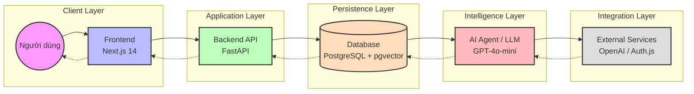

# Kiến trúc Hệ thống (System Architecture)

Tài liệu này mô tả cấu trúc phân tầng và luồng dữ liệu của trợ lý giáo dục AI.

---

## 1. Sơ đồ Tổng thể (High-Level Architecture)

Dưới đây là sơ đồ biểu diễn các thành phần chính và cách chúng tương tác với nhau:

---

## 2. Chi tiết các Tầng Kiến trúc

### 2.1. Người dùng (User)
- **Sinh viên:** Tương tác với trợ lý để đặt câu hỏi, xem lộ trình học tập.
- **Giảng viên:** Quản lý học liệu, xem báo cáo phân tích và phát hiện lỗ hổng kiến thức của lớp.

### 2.2. Frontend (Next.js 14)
- **Công nghệ:** App Router, Server Components, Tailwind CSS, shadcn/ui.
- **Vai trò:** Xử lý giao diện người dùng, quản lý phiên đăng nhập và giao tiếp với Backend qua REST API/Streaming.

### 2.3. Backend/API (FastAPI)
- **Công nghệ:** Python, Asynchronous logic, Pydantic v2.
- **Vai trò:** Điều phối logic nghiệp vụ, quản lý tài liệu, xử lý RAG (Retrieval-Augmented Generation) và bảo mật dữ liệu.

### 2.4. Cơ sở dữ liệu (Database)
- **Công nghệ:** PostgreSQL + pgvector.
- **Vai trò:** Lưu trữ dữ liệu quan hệ (Người dùng, Khóa học) và dữ liệu vector (Embeddings tri thức) trong cùng một hệ thống để đảm bảo tính nhất quán.

### 2.5. AI Agent / LLM
- **Công nghệ:** GPT-4o-mini, LangGraph.
- **Vai trò:** Suy luận ngữ cảnh, trả lời câu hỏi và sinh lộ trình học tập cá nhân hóa dựa trên dữ liệu từ Database.

### 2.6. Dịch vụ bên ngoài (External Services)
- **OpenAI:** Cung cấp API cho mô hình ngôn ngữ và mô hình embedding.
- **Auth.js:** Quản lý xác thực và phân quyền người dùng.

---

## 3. Luồng dữ liệu Chính (Core Data Flow)

Hệ thống hoạt động theo mô hình vòng lặp phản hồi:
1. **Dữ liệu vào:** Giảng viên nạp tài liệu -> Backend cắt nhỏ -> Embedding -> Lưu vào Database.
2. **Truy vấn:** Sinh viên hỏi -> Backend tìm vector tương đồng -> AI tổng hợp câu trả lời -> Phản hồi sinh viên.
3. **Phân tích:** Lịch sử chat được AI phân tích định kỳ để tạo ra Insights và Knowledge Gaps cho Giảng viên.
