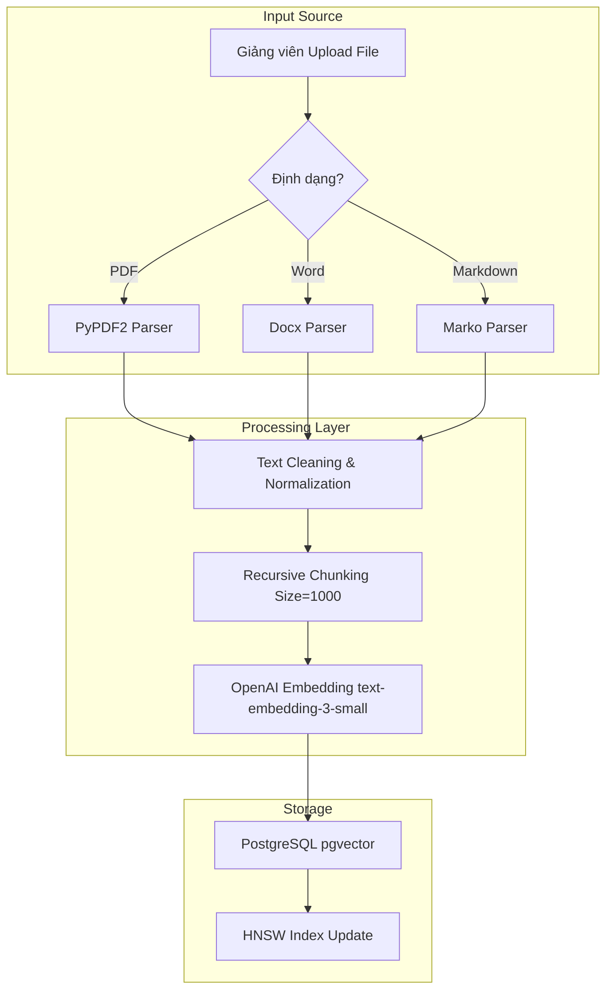
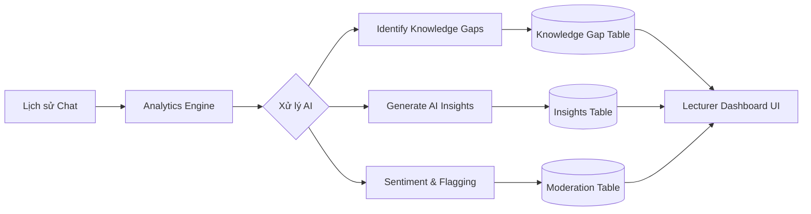

# Luồng dữ liệu Toàn hệ thống (Data Flow Specification)

Tài liệu này mô tả chi tiết cách thức dữ liệu di chuyển qua các thành phần của hệ thống, từ khi bắt đầu nạp tri thức cho đến khi tạo ra các giá trị phân tích cho giảng viên.

---

## 1. Giai đoạn 1: Nạp Tri thức (Knowledge Ingestion Pipeline)

Đây là quy trình chuyển đổi tài liệu thô thành dữ liệu có thể truy vấn ngữ cảnh.

---

## 2. Giai đoạn 2: Tương tác Học tập (RAG Interaction Loop)

Mô tả luồng dữ liệu khi sinh viên đặt câu hỏi cho trợ lý GPT-4o-mini.

1. **User Request:** Sinh viên gửi câu hỏi kèm theo `course_id` và `session_id`.
2. **Context Retrieval:**
    - Backend tạo embedding cho câu hỏi.
    - Truy vấn pgvector để tìm 5 đoạn văn bản có độ tương đồng cao nhất (Cosine Similarity) thuộc về `course_id` đó.
3. **Augmentation:**
    - Kết hợp: [System Instructions] + [Context Chunks] + [Chat History] + [Câu hỏi hiện tại].
4. **Inference:**
    - Gửi prompt tới **GPT-4o-mini** qua API OpenAI.
5. **Streaming Output:**
    - Kết quả được stream trực tiếp về UI qua Server-Sent Events (SSE).
6. **Persistence:**
    - Lưu tin nhắn vào database để phục vụ cho các phiên chat sau.

---

## 3. Giai đoạn 3: Phân tích & Phản hồi (Analytics & Insights Flow)

Luồng dữ liệu phục vụ cho công tác quản lý của giảng viên.

### Chi tiết Phân tích:
- **Knowledge Gaps:** Dữ liệu được trích xuất từ các câu hỏi mà AI trả lời với độ tự tin thấp hoặc không tìm thấy context. AI sẽ nhóm các câu hỏi này lại theo chủ đề.
- **AI Insights:** GPT-4o-mini định kỳ quét các xu hướng câu hỏi để đưa ra lời khuyên: "Nhiều sinh viên đang nhầm lẫn giữa khái niệm A và B, bạn nên tổ chức một buổi workshop về chủ đề này."
- **Moderation:** Tự động phát hiện và gắn cờ (flag) các nội dung nhạy cảm hoặc phản hồi tiêu cực từ sinh viên để giảng viên có thể can thiệp kịp thời.

---

## 4. Đặc điểm Kỹ thuật Luồng dữ liệu
- **Tính Bất đối xứng (Async):** Toàn bộ luồng nạp tài liệu và phân tích analytics được thực hiện ngầm, không làm gián đoạn trải nghiệm người dùng.
- **Tính Cách ly (Isolation):** Dữ liệu của các lớp học khác nhau không bao giờ giao thoa nhờ cơ chế lọc `course_id` ở tầng database.
- **Tính Bảo mật (Encryption):** Dữ liệu được mã hóa trong quá trình truyền tải (HTTPS) và bảo mật bằng hệ thống phân quyền chặt chẽ.
 stone.
