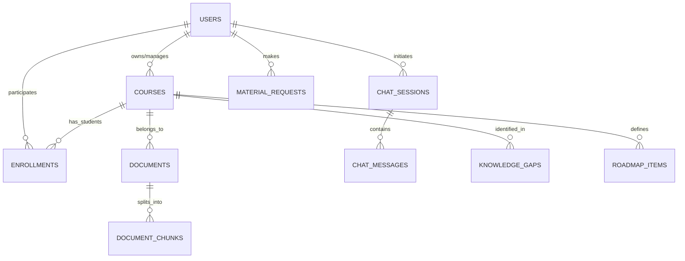

# Thiết kế Cơ sở Dữ liệu & Chiến lược Vector (Technical Specification)

Dự án sử dụng mô hình cơ sở dữ liệu hỗn hợp (Hybrid Database) với **PostgreSQL** là hạt nhân, kết hợp cùng **pgvector** để lưu trữ và truy vấn tri thức AI.

---

## 1. Mô hình Thực thể - Quan hệ (ERD)

Hệ thống được thiết kế để đảm bảo tính toàn vẹn dữ liệu cực cao trong khi vẫn duy trì sự linh hoạt cho các tác vụ AI.

### 1.1. Core Entities (Thực thể lõi)

### 1.2. Chi tiết các bảng quan trọng
- **`document_chunks`**: Lưu trữ các đoạn văn bản sau khi cắt nhỏ.
    - `id`: UUID (Primary Key)
    - `document_id`: UUID (Foreign Key)
    - `content`: TEXT (Nội dung thô của chunk)
    - `embedding`: VECTOR(1536) (Lưu trữ vector từ OpenAI)
    - `metadata`: JSONB (Lưu trữ số trang, chương, tiêu đề để trích dẫn)
- **`chat_messages`**: Lưu trữ lịch sử hội thoại.
    - `session_id`: UUID
    - `role`: VARCHAR (user/assistant)
    - `content`: TEXT
    - `is_flagged`: BOOLEAN (Dành cho moderation)
    - `feedback_rating`: INT (1-5, phục vụ cho AI Insights)

---

## 2. Chiến lược Lưu trữ Vector (Vector Strategy)

### 2.1. Tại sao chọn pgvector?
Thay vì sử dụng Pinecone hay Weaviate, chúng tôi chọn **pgvector** tích hợp trực tiếp trong PostgreSQL vì:
- **ACID Compliance:** Đảm bảo khi xóa một khóa học, toàn bộ vector liên quan cũng được xóa sạch ngay lập tức (không có dữ liệu mồ côi).
- **Relational Power:** Cho phép thực hiện các câu lệnh như: "Tìm 5 đoạn văn bản liên quan đến 'DNA' nhưng chỉ trong khóa học của Giảng viên A". 
- **Cost Efficiency:** Không cần duy trì thêm một dịch vụ database thứ hai, giảm chi phí vận hành.

### 2.2. Indexing Nâng cao (HNSW)
Hệ thống sử dụng index **HNSW (Hierarchical Navigable Small World)** trên cột `embedding`:
- **m (max connections):** 16
- **ef_construction:** 64
- **Lý do:** HNSW cung cấp sự cân bằng tốt nhất giữa tốc độ truy vấn (latency) và độ chính xác (recall), vượt trội hơn hẳn so với index IVFFlat truyền thống trong các ứng dụng RAG.

---

## 3. Luồng dữ liệu & Integrity

### 3.1. Cấu trúc Metadata (JSONB)
Chúng tôi sử dụng cột `JSONB` rộng rãi để lưu trữ dữ liệu không cấu trúc:
- Trong `documents`: Lưu trữ thông tin về cấu trúc file gốc (OCR logs, format type).
- Trong `roadmap_items`: Lưu trữ các yêu cầu phụ (dependencies) và link tài liệu liên quan.

### 3.2. Bảo mật Dữ liệu (Data Isolation)
Mọi truy vấn vào database (đặc biệt là tìm kiếm vector) đều bắt buộc phải kèm theo điều kiện lọc `course_id`. Điều này được triển khai ở tầng **Repository Layer** của Backend, ngăn chặn triệt để việc rò rỉ thông tin giữa các khóa học khác nhau.

### 3.3. Backup & Scaling
- **Automated Backups:** Hệ thống backup định kỳ hàng ngày (Snapshot).
- **Read Replicas:** Trong tương lai, các dashboard của giảng viên có thể đọc dữ liệu từ Read Replicas để không làm ảnh hưởng đến hiệu năng chat của sinh viên.
 stone.
