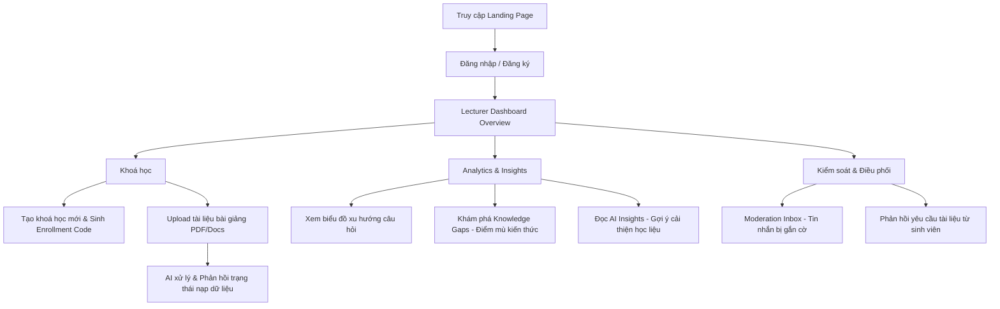
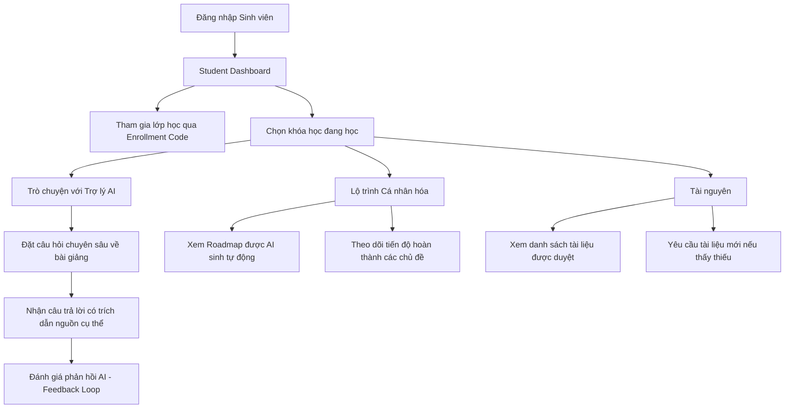

# Sơ đồ User Flow & Hành trình Trải nghiệm (Chi tiết)

Bản mô tả chi tiết các điểm chạm (touchpoints) của người dùng trong hệ thống AI Teaching Assistant.

## 1. Vai trò Giảng viên (The Architect)
Mục tiêu: Quản lý tri thức và theo dõi hiệu suất lớp học.

## 2. Vai trò Sinh viên (The Learner)
Mục tiêu: Học tập cá nhân hóa với sự hỗ trợ 24/7 của trợ lý GPT-4o-mini.

## 3. Các điểm tương tác đặc biệt
- **Feedback Loop:** Sinh viên đánh giá câu trả lời của AI giúp hệ thống tinh chỉnh Prompt và thông báo cho Giảng viên về những câu hỏi chưa được giải đáp tốt.
- **Dynamic Roadmap:** Lộ trình học tập không tĩnh mà thay đổi dựa trên mức độ hiểu bài của sinh viên (được GPT-4o-mini phân tích từ lịch sử chat).
